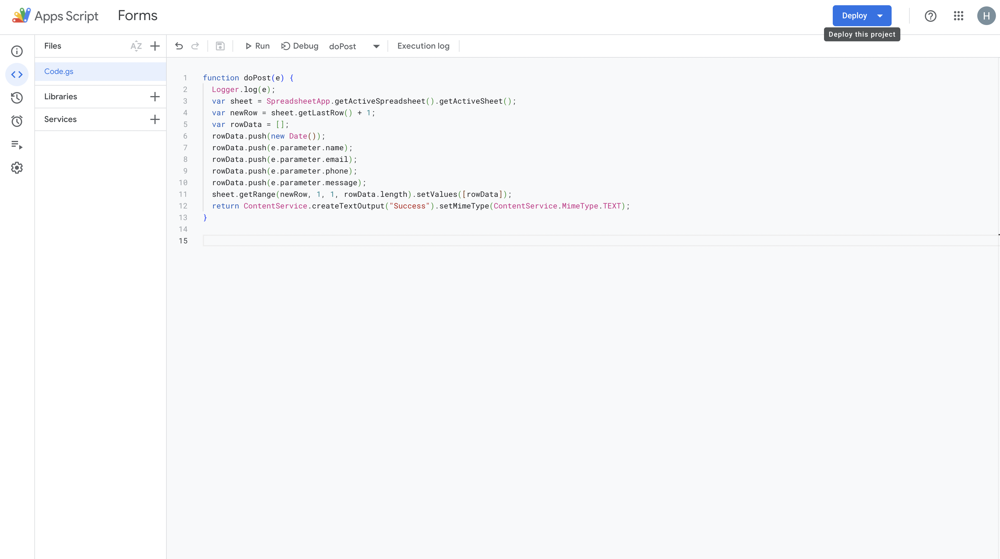
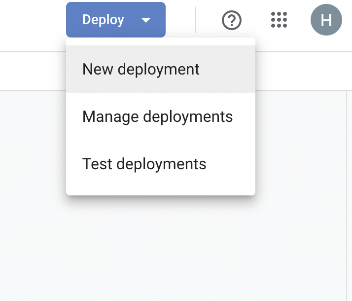
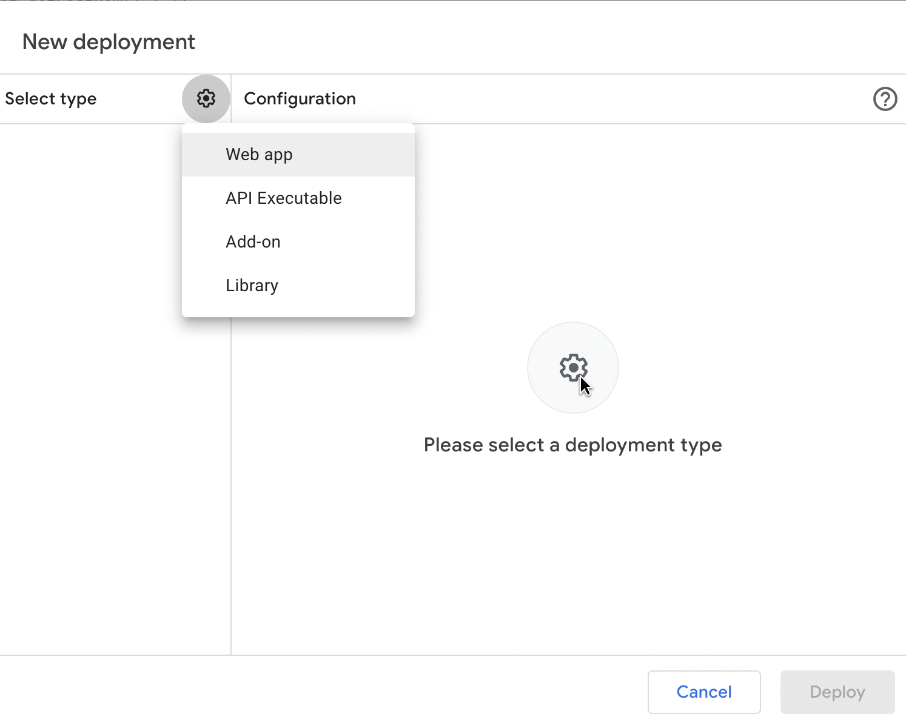
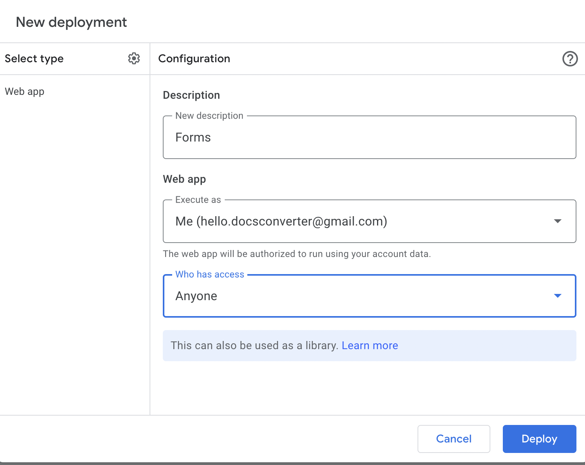
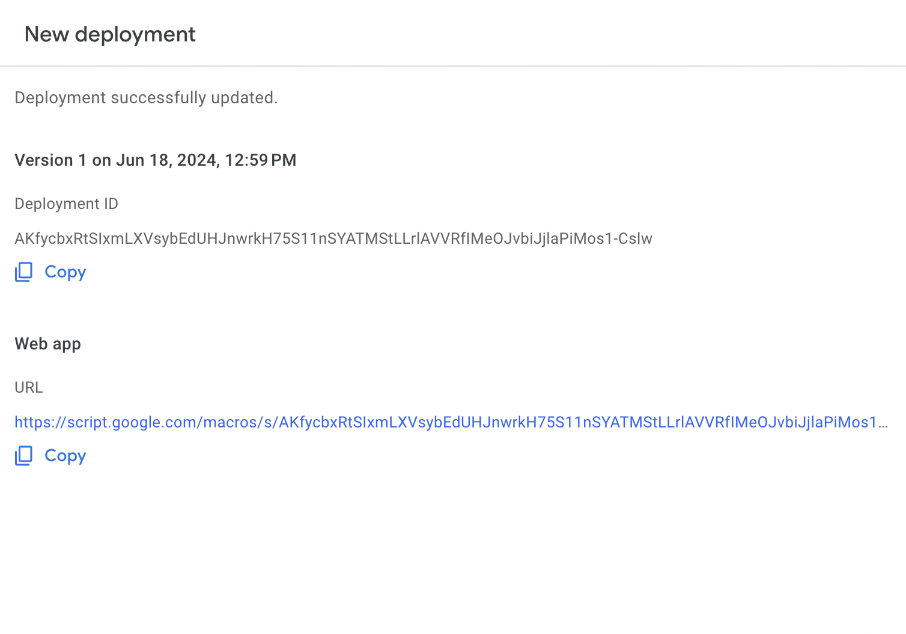
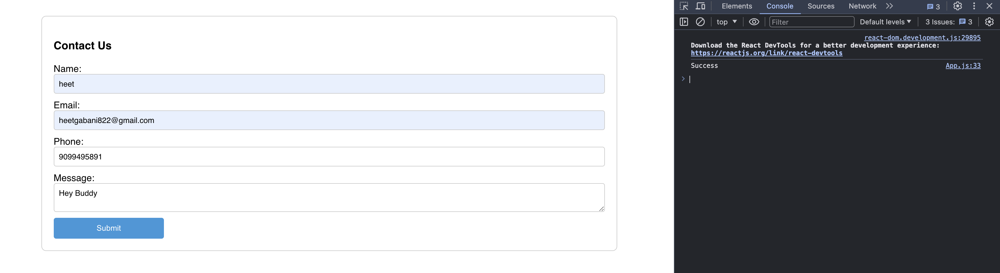
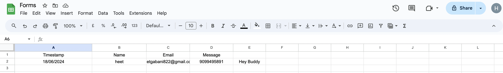

# React-Form-Google-Spreadsheet

React Form Handling With Google Spreadsheet

For your understandings i added Code.gs code in src folder of directory open google spreadsheet in menubar you can see extensions in the extensions Go to appscript and follow the steps given below 

#  Step: 1
Open Google Spreadsheet And Go Extensions>AppScript

# Step: 2

# Step: 3

# Step: 4

# Step: 5

# Step: 6

# Step: 7

